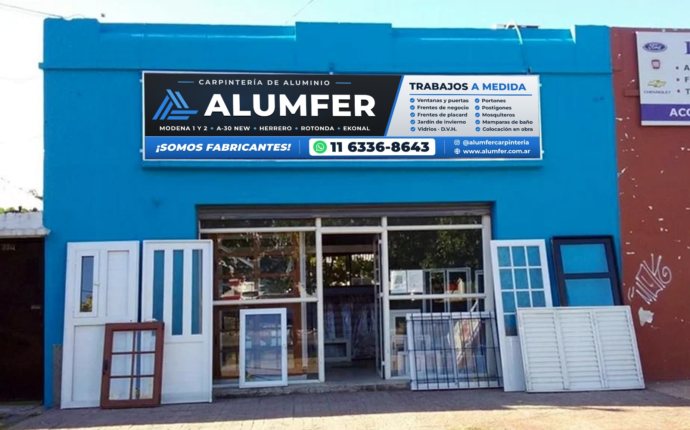

# Cartel del frente — Alumfer (5400 × 1200)

Cartel para el frente del local (Av. San Martín 734, Adrogué). Reemplaza al cartel
viejo y a la propuesta con TikTok y dos teléfonos. Usa la misma información que el
volante 10×15 (`2026-07-volante-10x15`, en la rama `claude/alumfer-instagram-carousel-n8sdfp`).



## Especificaciones

| Dato | Valor |
|---|---|
| Medida | **5,40 × 1,20 m** (proporción 4,5 : 1). En el diseño, 1 px = 3 mm |
| Para la imprenta | `export/Alumfer_cartel_vectorial_escala_1-10.pdf` (540 × 120 mm → **ampliar ×10**) |
| PNG | `export/Alumfer_cartel_5400x1200.png` y `export/Alumfer_cartel_10800x2400_alta.png` (~50 DPI a tamaño real) |
| Colores | Carbon `#15181b`, Azul Alumfer `#1B6CC8` / `#4A9DE8`, aluminio claro, blanco |
| Tipografía | Montserrat (incluida en `assets/`) |

El PDF está a escala 1:10 (así se trabaja en gigantografía; los PDF no admiten
páginas de más de 5 m). Texto, isologo e íconos van **en vector**, así que se amplían
sin perder calidad. Solo los tres fondos degradé van como imagen, y al ser lisos no se nota.
Si piden sangrado, extender los mismos fondos 3–5 cm por lado.

### Legibilidad a tamaño real (altura de mayúsculas aprox.)

| Texto | Altura | Se lee desde |
|---|---|---|
| ALUMFER | ~32 cm | más de 50 m |
| 11 6336-8643 | ~14 cm | ~40 m |
| ¡Somos fabricantes! / Trabajos a medida | ~10 cm | ~30 m |
| Líneas y lista de productos | ~5–6 cm | ~15 m (vereda de enfrente) |

## Contenido

- **Carpintería de aluminio · ALUMFER** (isologo redibujado en vector: `assets/isologo.svg`)
- Líneas: Modena 1 y 2 · A-30 New · Herrero · Rotonda · Ekonal
- **Trabajos a medida:** ventanas y puertas, portones, frentes de negocio, postigones,
  frentes de placard, mosquiteros, jardín de invierno, mamparas de baño, vidrios · D.V.H.,
  colocación en obra
- Franja: **¡Somos fabricantes!** · WhatsApp **11 6336-8643** · @alumfercarpinteria · www.alumfer.com.ar

No lleva QR: a 3 m de altura no se escanea cómodo. El QR de WhatsApp está en
`assets/qr.svg` para poner como vinilo en la vidriera o la puerta.

## Archivos

```
cartel.html              Diseño (1800x400 px CSS = 5400x1200 mm).
assets/
  isologo.svg            Isologo en vector (trazos a 60°), redibujado de solologo.png.
  qr.svg                 QR de WhatsApp (para vidriera / puerta).
  Montserrat.ttf
export/
  Alumfer_cartel_vectorial_escala_1-10.pdf   Para la imprenta (ampliar x10).
  Alumfer_cartel_5400x1200.png
  Alumfer_cartel_10800x2400_alta.png
  mockup-frente.jpg      Simulación sobre la foto del local.
scripts/
  export.mjs             Regenera los PNG y el PDF (npm i playwright-core).
  gen-qr.mjs             Regenera el QR (npm i qrcode).
```

## Cómo editar y exportar

1. Editar textos/tamaños en `cartel.html` (se ve abriéndolo en el navegador).
2. `npm i playwright-core && node scripts/export.mjs`
   (usa el Chromium de `CHROMIUM`, por defecto `/opt/pw-browsers/chromium`).
