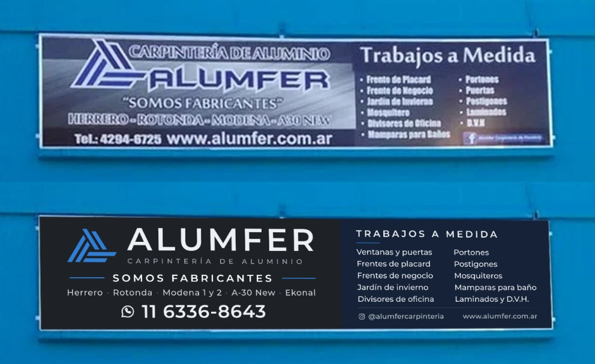

# Cartel del frente — Alumfer (5400 × 1200)

Actualización del cartel instalado en el frente (Av. San Martín 734, Adrogué), hecho
alrededor de 2015. Se mantiene **la misma estructura** (isologo azul y ALUMFER a la
izquierda; panel azul noche con "Trabajos a medida" a la derecha) con un lenguaje más
sobrio y elegante, acorde a aberturas de primera línea: una sola tipografía (Montserrat)
en pesos medios, sin cursivas ni contornos, fondos lisos, el azul solo como acento y
mayúsculas espaciadas. Se ponen al día los datos, con la información
del volante 10×15 (`2026-07-volante-10x15`, rama `claude/alumfer-instagram-carousel-n8sdfp`).



### Qué cambia respecto del cartel de 2015

| Antes | Ahora |
|---|---|
| Tel.: 4294-6725 | WhatsApp **11 6336-8643** |
| Facebook "Alumfer Carpintería de Aluminio" | Instagram **@alumfercarpinteria** |
| Herrero - Rotonda - Modena - A30 New | Herrero – Rotonda – **Modena 1 y 2** – A-30 New – **Ekonal** |
| Lista de trabajos | Se suma Ventanas; Laminados y D.V.H. en una línea; textos corregidos (plurales, tildes) |
| Letras gruesas con contorno, cursivas, fondo con brillos | Tipografía fina y espaciada, fondos lisos, todo en vector |

## Especificaciones

| Dato | Valor |
|---|---|
| Medida | **5,40 × 1,20 m** (proporción 4,5 : 1). En el diseño, 1 px = 3 mm |
| Para la imprenta | `export/Alumfer_cartel_vectorial_escala_1-10.pdf` (540 × 120 mm → **ampliar ×10**) |
| PNG | `export/Alumfer_cartel_5400x1200.png` y `export/Alumfer_cartel_10800x2400_alta.png` (~50 DPI a tamaño real) |
| Colores | Grafito `#1e2227`, azul noche `#152238`, azul `#2f7fd6` (isologo y filetes), blanco y gris claro |
| Tipografía | Montserrat (incluida en `assets/`) |

El PDF está a escala 1:10 (así se trabaja en gigantografía; los PDF no admiten
páginas de más de 5 m). Es **100 % vectorial** (sin imágenes): se amplía sin perder calidad.
Si piden sangrado, extender los mismos fondos 3–5 cm por lado.

### Legibilidad a tamaño real (altura de mayúsculas aprox.)

| Texto | Altura | Se lee desde |
|---|---|---|
| ALUMFER | ~25 cm | ~50 m |
| 11 6336-8643 (con logo de WhatsApp) | ~14 cm | ~40 m |
| SOMOS FABRICANTES | ~8 cm | ~25 m |
| Trabajos a medida | ~7 cm | ~20 m |
| Líneas, lista de trabajos, Instagram y web | ~6 cm | ~18 m (vereda de enfrente) |

## Contenido

- **Carpintería de aluminio · ALUMFER** (isologo redibujado en vector: `assets/isologo.svg`)
- **"Somos fabricantes"**
- Herrero – Rotonda – Modena 1 y 2 – A-30 New – Ekonal
- WhatsApp **11 6336-8643** · www.alumfer.com.ar
- **Trabajos a medida:** ventanas y puertas, frentes de placard, frentes de negocio,
  jardín de invierno, divisores de oficina, portones, postigones, mosquiteros,
  mamparas para baño, laminados y D.V.H.
- Instagram **@alumfercarpinteria**

No lleva QR: a 3 m de altura no se escanea cómodo. El QR de WhatsApp está en
`assets/qr.svg` para poner como vinilo en la vidriera o la puerta.

## Archivos

```
cartel.html              Diseño (1800x400 px CSS = 5400x1200 mm).
assets/
  isologo.svg            Isologo en vector (trazos a 60°), redibujado de solologo.png.
  qr.svg                 QR de WhatsApp (para vidriera / puerta).
  Montserrat.ttf
export/
  Alumfer_cartel_vectorial_escala_1-10.pdf   Para la imprenta (ampliar x10).
  Alumfer_cartel_5400x1200.png
  Alumfer_cartel_10800x2400_alta.png
  mockup-frente.jpg      Simulación sobre la foto del local.
  antes-despues.jpg      Cartel actual vs. actualizado.
scripts/
  export.mjs             Regenera los PNG y el PDF (npm i playwright-core).
  gen-qr.mjs             Regenera el QR (npm i qrcode).
```

## Cómo editar y exportar

1. Editar textos/tamaños en `cartel.html` (se ve abriéndolo en el navegador).
2. `npm i playwright-core && node scripts/export.mjs`
   (usa el Chromium de `CHROMIUM`, por defecto `/opt/pw-browsers/chromium`).
